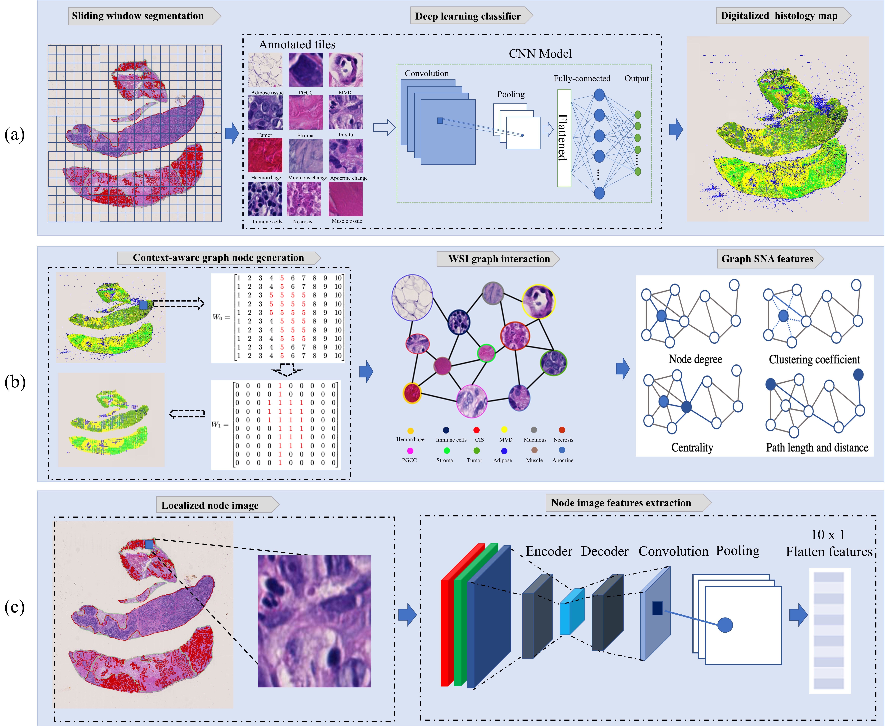

# BreastCancerHistologyTiles  
An Open Source Project for Annotated Breast Cancer Histology Tile Dataset  

## Overview  
BreastCancerHistologyTiles is an open-source initiative aimed at creating a comprehensive, annotated dataset of breast cancer histology tiles. The dataset is generated from TCGA-BRCA whole-slide images (WSIs) and is intended to support advancements in histopathology research, computer vision applications, and breast cancer diagnostics.

We have processed all TCGA-BRCA WSIs to produce high-quality, context-aware histology tiles. Currently, this project is under active development. As such, only a portion of the dataset is available for download at this stage.

## Status  
This project is **under construction**. The full dataset will be released incrementally. We encourage researchers to contribute or provide feedback to improve this resource.

## Contributing  
We welcome contributions to this project. If you'd like to help expand the dataset, refine the annotations, or provide feedback, please contact me: qiangli.ce@gmail.com.

# Introduction histology map generation

This repository contains a PyTorch implementation of a deep learning based graph-transformer for whole slide image (WSI) classification. We propose a Histology Map based Graph-Transformer network that fuses a graph representation of a WSI and a transformer that can generate WSI-level predictions in a computationally efficient fashion.

## How to Use  
To use this dataset, please make sure to cite the related article:  
**NACNet: A histology context-aware transformer graph convolution network for predicting treatment response to neoadjuvant chemotherapy in Triple Negative Breast Cancer**  
DOI: [https://doi.org/10.1016/j.compmedimag.2024.102467]  

